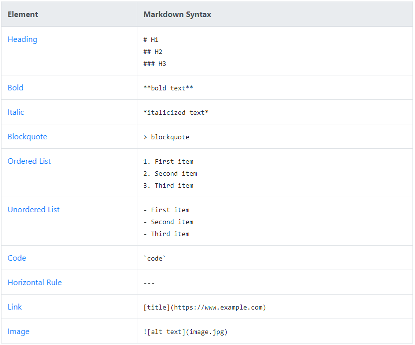

# Application-Web-Design

* ## Detalles del alumno: 
Roberto Carlos Cavazos Arredondo, al02851984, Ingenieria en Desarrollo de Software, 8vo Semestre.

* ## Asignatura:
Diseño de aplicaciones web, Profesor. ERIK EZEQUIEL CARRILLO MOO.

* ## Utilizacion de lenguaje "Markdown": 
Markdown es un lenguaje de marcado sencillo que permite agregar formato, links e imágenes con facilidad al texto simple.

# Tagging Options Markdown

# Git Commands

* ### Verificar el estado de un repositorio local:
git status 

* ### Agregue archivos individuales o globalmente:
git add

* ### Agregar comentarios a la confirmación:
git commit -m "Commit message"

* ### Cargue sus cambios en el repositorio remoto:
git push origin master

* ### Cree, explore y elimine sucursales:
Crear: git branch -M main

Explorar: git branch 

Eliminar: git branch -d branchname

* ### Revertir un repositorio a una confirmación específica:
git reset --hard origin/master
